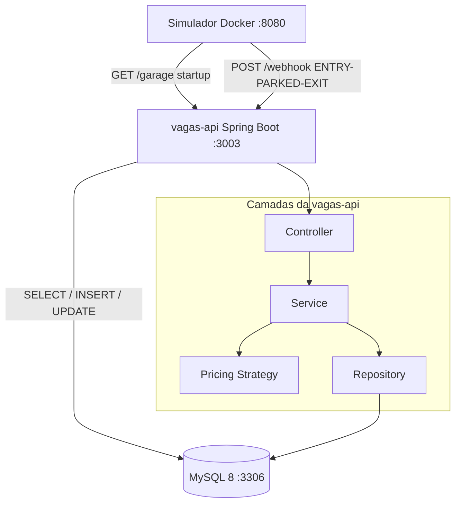
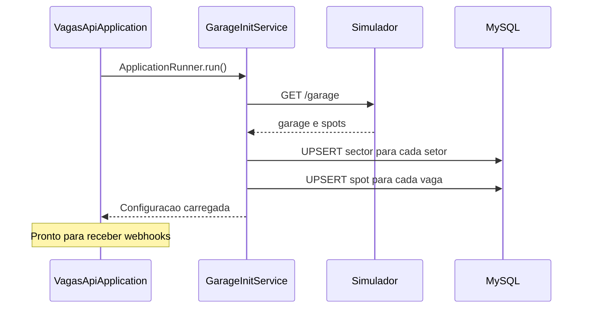

# Arquitetura

## Visão Geral

A `vagas-api` é uma aplicação Spring Boot 3 estruturada no padrão clássico MVC em camadas.
Ao iniciar, busca a configuração da garagem no simulador e persiste os dados no MySQL.
Após isso, fica pronta para receber eventos via Webhook.

---

## Diagrama de Arquitetura

---

## Responsabilidade de cada camada

**Controller** — recebe a requisição HTTP, valida o payload com `@Valid` e delega para o service. Sem lógica de negócio.

**Service** — contém toda a lógica de negócio: validação de capacidade, cálculo de preço, atualização de vaga e cálculo de cobrança. Usa `@Transactional`.

**Pricing** — isolamento total da regra de preço dinâmico via Strategy Pattern. O `PricingStrategyResolver` recebe a taxa de ocupação e retorna a implementação correta.

**Repository** — interfaces Spring Data JPA. Toda persistência passa por aqui. Queries com `SELECT FOR UPDATE` para evitar race conditions.

**Domain** — entidades JPA, enums e exceptions customizadas. Sem dependências do Spring.

**DTO** — Java records para request e response. Completamente isolados das entidades de domínio.

**Handler** — `GlobalExceptionHandler` com `ProblemDetail` (RFC 7807) mapeando cada exception para o HTTP status correto.

---

## Fluxo de inicialização

