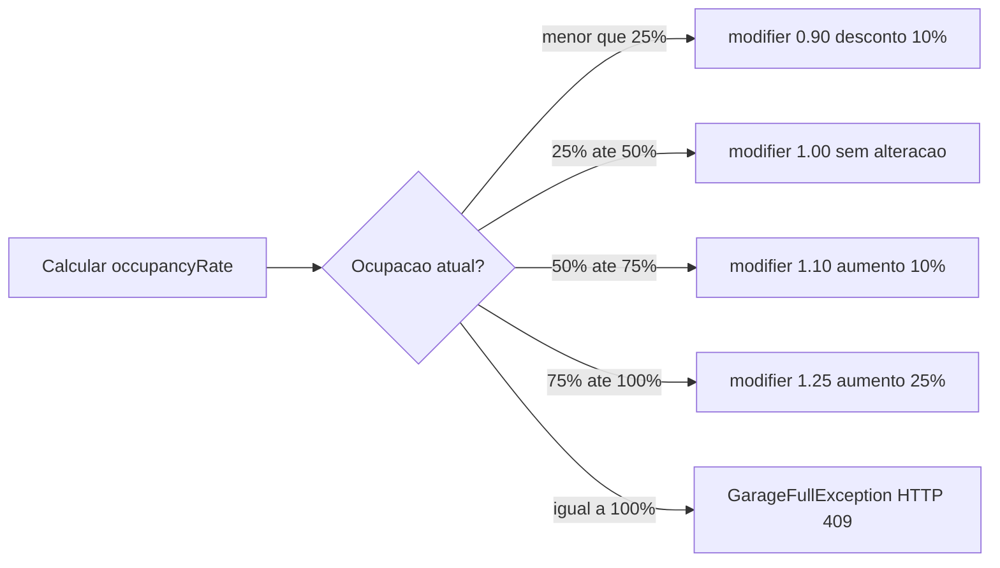

# Regras de Negócio

---

## Controle de Capacidade

Uma entrada (`ENTRY`) só é permitida se a ocupação total da garagem for menor que 100%.

A verificação é feita com ocupação **global** (soma de todos os setores), porque a garagem possui um único grupo de cancelas na entrada. O setor ainda não é conhecido no momento do `ENTRY`.

Com 100% de lotação, o sistema rejeita novas entradas com `HTTP 409` até que um veículo saia.

---

## Preço Dinâmico

O modificador de preço é calculado no momento do `ENTRY` com base na taxa de ocupação global.



| Taxa de ocupação global | Modificador | Efeito no preço |
|---|---|---|
| < 25% | 0.90 | Desconto de 10% |
| >= 25% e < 50% | 1.00 | Sem alteração |
| >= 50% e < 75% | 1.10 | Aumento de 10% |
| >= 75% e < 100% | 1.25 | Aumento de 25% |
| = 100% | bloqueado | HTTP 409 |

O `occupancy_modifier` é armazenado na `parking_session` no momento do `ENTRY` e **nunca é recalculado**.

---

## Cálculo do `price_per_hour`

Travado no momento do `PARKED`, quando o setor já é conhecido:

```
price_per_hour = sector.base_price x session.occupancy_modifier
```

**Exemplo:** `base_price = 10.00`, `modifier = 1.10` → `price_per_hour = 11.00`

---

## Cálculo da Cobrança no EXIT

```
total_minutes = exit_time - entry_time (em minutos)

se total_minutes <= 30:
    amount = 0.00  (período de cortesia)
senão:
    hours = ceil(total_minutes / 60.0)
    amount = hours x price_per_hour
```

O arredondamento usa `Math.ceil` — qualquer fração de hora é cobrada como hora cheia.

### Tabela de exemplos

| Entrada | Saída | Minutos | Horas `ceil` | `price_per_hour` | `amount` |
|---|---|---|---|---|---|
| 12:00 | 12:30 | 30 | cortesia | 10.00 | **0.00** |
| 12:00 | 12:31 | 31 | 1 | 10.00 | **10.00** |
| 12:00 | 13:00 | 60 | 1 | 10.00 | **10.00** |
| 12:00 | 13:01 | 61 | 2 | 10.00 | **20.00** |
| 12:00 | 13:29 | 89 | 2 | 10.00 | **20.00** |
| 12:00 | 13:30 | 90 | 2 | 10.00 | **20.00** |
| 12:00 | 13:31 | 91 | 2 | 10.00 | **20.00** |
| 12:00 | 14:01 | 121 | 3 | 10.00 | **30.00** |

> O limite de 30 minutos é **inclusivo**: exatamente 30 minutos = cortesia.

---

## Unicidade de Sessão

O sistema impede que a mesma placa tenha mais de uma sessão ativa simultaneamente.
Uma sessão é considerada ativa enquanto seu `status` for `ENTERED` ou `PARKED`.

Ao receber um `ENTRY` para uma placa já ativa, o sistema retorna `HTTP 409`.
