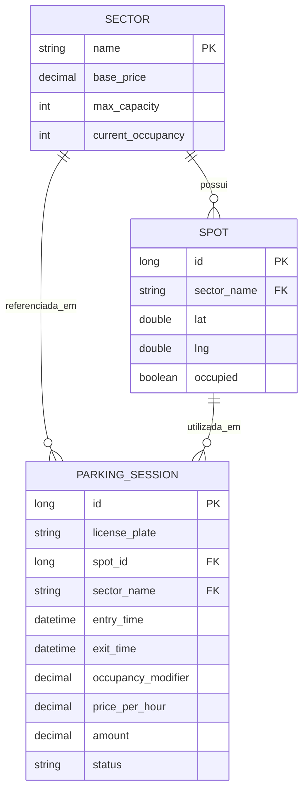

# Banco de Dados

Engine: MySQL 8. Todos os timestamps armazenados em UTC.

---

## Modelo de Dados

---

## Descrição das Tabelas

### `sector`

Armazena os setores da garagem carregados do simulador na inicialização.
`current_occupancy` é incrementado/decrementado dentro da mesma transação que altera `spot.occupied`, garantindo consistência.

### `spot`

Cada vaga física da garagem. Identificada pelo `id` vindo do simulador e localizada pelas coordenadas `lat/lng` — que são usadas no evento `PARKED` para encontrar a vaga correta.

### `parking_session`

Ciclo de vida completo de um veículo. Os campos `spot_id`, `sector_name`, `price_per_hour` e `amount` são preenchidos progressivamente conforme os eventos chegam:

| Campo | Preenchido no evento |
|---|---|
| `license_plate`, `entry_time`, `occupancy_modifier` | `ENTRY` |
| `spot_id`, `sector_name`, `price_per_hour` | `PARKED` |
| `exit_time`, `amount` | `EXIT` |

---

## Índices

| Tabela | Nome do índice | Colunas | Finalidade |
|---|---|---|---|
| `spot` | `idx_spot_sector` | `sector_name` | Filtrar vagas por setor |
| `spot` | `idx_spot_lat_lng` | `lat, lng` | Localizar vaga pelas coordenadas do evento `PARKED` |
| `parking_session` | `idx_session_plate` | `license_plate` | Buscar sessão ativa pela placa |
| `parking_session` | `idx_session_status` | `status` | Filtrar sessões por estado |

---

## Estratégia de Locking

As linhas de `Sector` e `Spot` são bloqueadas com `SELECT ... FOR UPDATE` (lock pessimista de escrita) dentro dos métodos `@Transactional` de `handleParked` e `handleExit`.

Isso impede que duas transações concorrentes leiam a mesma contagem de ocupação e causem overbooking.

---

## Observações

- `spring.jpa.hibernate.ddl-auto=update` gerencia o DDL automaticamente. Para produção, migrar para Flyway ou Liquibase.
- Campos monetários usam `DECIMAL` — nunca `DOUBLE` ou `FLOAT`, que perdem precisão em aritmética decimal.
- Timestamps usam `DATETIME` com `timezone=UTC` configurado no datasource e no Hibernate.
