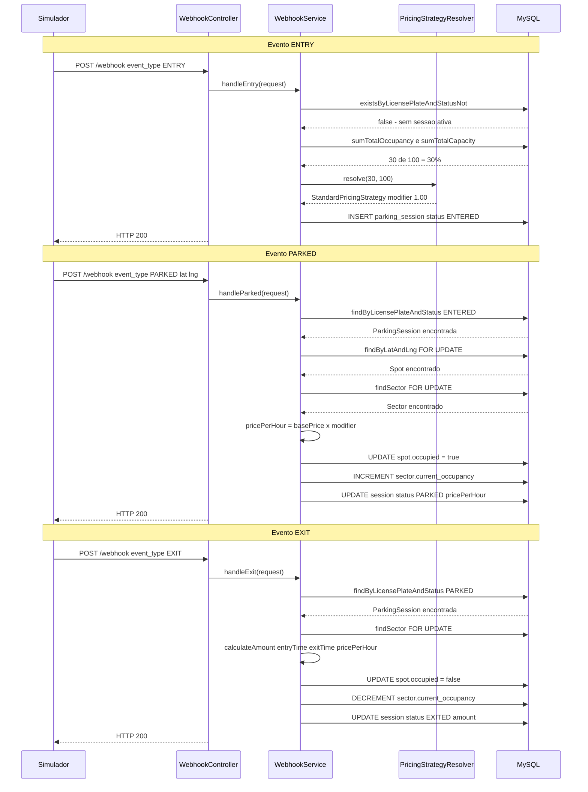

# Fluxo de Eventos

O simulador envia três tipos de evento em sequência para cada veículo: `ENTRY` → `PARKED` → `EXIT`.

---

## Diagrama de Sequência Completo

---

## Caminhos de Erro

| Situação | Exceção | HTTP |
|---|---|---|
| Garagem 100% cheia no `ENTRY` | `GarageFullException` | 409 |
| Placa já tem sessão ativa no `ENTRY` | `ActiveSessionAlreadyExistsException` | 409 |
| Placa não encontrada com status `ENTERED` no `PARKED` | `VehicleNotFoundException` | 404 |
| Coordenadas não correspondem a nenhuma vaga | `SpotNotFoundException` | 404 |
| Placa não encontrada com status `PARKED` no `EXIT` | `VehicleNotFoundException` | 404 |
| Payload inválido (campo obrigatório ausente) | `MethodArgumentNotValidException` | 400 |
